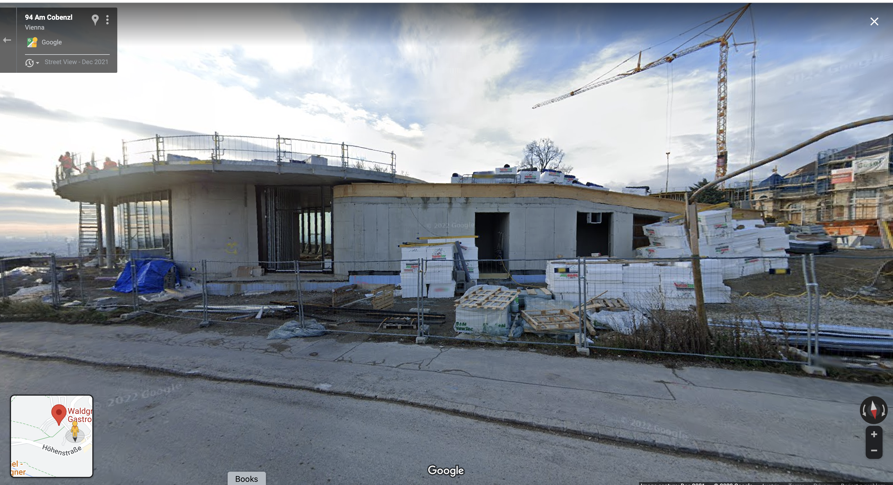

# An idiosyncratic guide to some things which I like about Vienna

This is an idiosyncratic guide to some things which I like about Vienna.
It may grow to function as a 'real' guide, but really, if you have a 
day or two, check out one of Rick Steve's guidebooks.

But there are multiple dimensions to every place. I was out at 
the Musickverein one night with a friend on a couple of 6 euro
standing room tickets. And we were chatting with people who felt
like they had gotten a 'deal' with their 30 euro tickets. 

Bars: 4am is the standard closing time, but things like closing times
can be flexible.

How to have fun in bars in Vienna? Just talk with people. As a 
Vienna Bartender says 'Just don't give a fuck.' I'm inclined to 
be shy, but from a rational POV, what do you care if you make a fool
of yourself?

As I was writing that a fellow fell over behind me. And Phillip said
"He's really quite a nice guy." And I had been chatting with him. He
seemed like a nice guy. An extremely drunk nice guy. And he had some
issues. A sick family member. And then he fell over.

Shit happens. And your embarrassment at not knowing how to order a beer
in a foreign language is no greater than falling over drunk after drinking a 
bit too much because you are 'introverted, drunk, and grumpy.' And have a mother
dying of cancer.

What is real in a city which for hundreds of years has been 
reinventing itself? A city of Historisch where the natural history
museum and Adolf Loos can coexist.

The city is old and it is as new and modern as a city can be. Deal
with the dissonance. People living in apartments older than your
country who are also wild about Ikea. And a street art scene driven
by people who could give fuck one about their 'Illustrious History.'

Native Viennese learning their history from field trips to the First
District who mostly just welcome the respite from school, who later pub crawl
in 'the Bermuda Triangle' with no recognition that the 
Schwedenplatz UBahn station is near where there was once a port for the Roman 
garrison [Vindobona](https://en.wikipedia.org/wiki/Vindobona)
1900 years ago (where emperor Marcus Aurelius died, in 180 AD).
and who may notice the old church on the 
corner, Rupert Kirche, but maybe they won't notice it. And if it is
pointed out they ask 'Is it old old, or reconstructed old.' Because they
have filters for the cult of history, the nonsense which permeates
the Viennese built environment.

"Wow, this is like the home of Christmas" and "These buildings are
older than my country." But no, that is, not everything that appears
old is old. The Ringstrasse was built in the area where the city walls
once stood. The city walls that were partially torn down by by Napoleon. 
And the neogothic city hall (Rathaus) is newer than a good number of the 
buildings in downtown Pittsburgh.

This is an appreciation, not a criticism. Watching a filmed performance
of Carmen in front of the Rathaus with 5,000 other people and then 
marveling as the film ends and the lights of the Rathaus are 
dramatically relit is no less bone-chillingly amazing just because the
Rathaus is neogothic from 1872-1883 rather than 'real' gothic from
the 1300's.

The Habsburg empire in the late 19th century created a stage upon which
a great deal of the world's post-WWII cultural life has been encouraged
to take place. It is as real as you want it to be, and if you doubt that,
go to Michlerplatz and view the 1700 year-old Roman Ruins. Or much 
newer, take the Ubahn to Stephansplatz and view VirgilKapelle, used as 
a dump for the remains of the collapsed Magdalene chapel, burned in 1781,
forgotten until being rediscovered during construction of the U-Bahn in 1973.

You can exit the busy 21st-century subway and take a peak at the 
800-year-old chapel. People painted crosses and mosaics on walls 800 years ago,
and now you see it from the subway.

Besser gehts nicht. Real, recreated, reimagined, repurposed, it all 
happens and it has been happening here for 1800 years, and more.  

- Riding transit in general, interesting stops like Gasometer, Donauinsel, Karl Marx Hof, etc.
  D Tram
  13 Bus

## Getting Around

- [Bike rentqls](https://www.wien.info/en/livable-vienna/sports/cycling/bicycle-rentals-341248) lots of options
- [Karlsplatz and the Living hotel](karlsplatz.md)

- [Journeys Paths through the city which I recommend](journeys.md)

## Sunday

- The stores in Vienna are mostly closed on Sundays. But some markets remain open in some of 
  the train and U-Bahn stations.
  [An arbitrary article with a list of shops that are open](https://www.virtualvienna.net/living-in-vienna/shopping/open-sundays/)

## Resources

- [Johannes' List](vienna_johannes_list.md)
- [City of Wien official map](https://www.wien.gv.at/stadtplan/en/)
- [Lorenz Seidler - Esel](https://esel.at/) Office in the MQ, chronicler of Viennese culture. [His Kalendar](https://esel.at/termine) is good.
- [Vienna Würstelstand](https://viennawurstelstand.com/) English guide to Vienna events
-
- [Convert OSM relations to a mappable format](https://overpass-turbo.eu/#)

## Events

- [Film Festival at Rathausplatz](https://filmfestival-rathausplatz.at/)
  Rathaus platz
  July 1st-September 3rd, 2023

  There is often something happening in Rathausplatz. From a Christmas 
  market, to a skating wonderland, to other things, and then the film
  festival in the summer.

  Food and drink booths open at 11, and 'films' start when it gets dark.
  They show filmed operas and concerts, and it is all great fun.

- [Guide to Open Air Cinemas](https://viennawurstelstand.com/guide/your-ultimate-guide-to-viennas-open-air-cinemas/)

## People

## Markets

The Nachmarkt is the well know market. And it is fun. But many of the 
vendors absolutely will take advantage of you. If you want 100 g of
olives, for example, you need to be absolutely firm.

Or 100 g of cheese. It took us a week to finish the half-kilo chunk
of cheese that we got when we asked for 100 grams (Christine wants
to point out that we did absolutely finish it, and that it was delicious).

There is a Flohmarkt on Saturdays from 6:30 am - 2:30 pm, or later. One
way to experience this is to be out late and then stumble on the market
when you are on your way home at 6:30 in the morning. 

But for real markets, try the Viktor-Adler-Markt in the Tenth District.

## Districts

Vienna is divided into 23 Bezirk's, or municipal districts. And people
have opinions about the character of the different districts. 

## First District

The First District is small, about 1.2 km across, and the more interesting
things are mostly close to each other

- Stephansdom St. Stephan's Cathedral
  Stephansplatz 3, 1010 Wien

  If you pick the exit from the U-Bahn station that passes the Virgelkapelle 
  then you will emerge from the ground to have the majesty of Stephansdom 
  slowly revealed as you ascend.

  One of the things that I love about the U-Bahn is how you can emerge from 
  a station in a totally different place. Not just a different spot on the 
  map, but a deeply different place in time.

  On the outside of the Cathedral look for the two "ell's," iron rods embedded
  in the wall, the official measures for lengths of cloth.

  And look for the O5 under a plate of glass. The cipher of the Austrian 
  resistance. The abbreviation for Österreich is OE. E is the fifth letter
  of the alphabet.

- Buffet Trzesniewski Dorotheergasse
  Dorotheergasse 1, 1010 Wien  
  [Cute little sandwiches.](https://photos.app.goo.gl/enUcDy9ct71DoByn9)

  (there is another Buffet Trzesniewski on Mariahilfer Straße by the Zieglergasse
  U-Bahn station)

- Virgilkapelle
  Stephansplatz U-Bahn station
  A chapel from the middle ages, lost from 1782 until construction of the U-Bahn
  rediscovered it.

- Kaisergruft / Kapuzinergruft
  Tegetthoffstraße 2, 1010 Wien, Austria
  The imperial crypt. If one wants to explore the history of the Habsburgs one 
  could do worse than to explore how they chose to be shuffled off of this
  mortal coil. 

  Time is long, life is short, and you can have that truth smashed in your face
  in so many different ways, in so many different places. For me, being 
  surrounded by 400 years of history, 400 years of opinions on what to do 
  when you are one of the most powerful people in the world but
  death still comes for you offers one of those reminders.

  If you don't go to the crypt you can [skim the wikipedia page](https://en.wikipedia.org/wiki/Imperial_Crypt)
  and get a lot of context about historical Vienna.

- Augustinerkirche
  Augustinerstraße 3, 1010 Wien, Austria
  The hearts of many of the Habsburgs are stored here, which is fine if one 
  is into that sort of thing.

  When I first visited the Augustiner, on a Saturday, an organist was practicing
  the same few bars of a piece that I don't know. And as organ music does, the
  music filled the church, and I stumbled on the memorial to Archduchess Maria
  Christina by Antonio Canova. And since then, I try to go back for a visit
  with the sculpture. There is another Canova, the Centaur, in the Kunsthistorisches
  museum. 

- [Michaelerkirche](https://www.michaelerkirche.at/en/tours-crypt/)
  Michaelerplatz 5, 1010 Wien, Austria

  When I took the tour in 2006 the guide told stories of how the caskets
  in the Kaisergruft used to be as dilapidated as those in Michaelerkiche,
  but that the Kaisergruft was then restored.

  For maximum creepy/momento mori crypt time I think the Michaelerkiche
  is tops. It is smaller and more intimate, and if you are lucky you
  might get the guide I had who lovingly caressed the dress on a
  corpse and described the fabric and the dress with love, as though it
  was the latest in fashion.

  Just because people are dead doesn't mean that they can't still be alive.

- Bermuda Triangle
  Vienna is filled with history rubbing against the present. You can take
  an escalator into a subway and the stone wall is actually a Roman wall,
  or maybe just part of the mostly removed medieval city wall.

  And you can get lost in the Bermuda Triangle next to the oldest church
  in Vienna.

  I have stories about this area, but I'm not sure about putting them down
  in writing, so here is [a random article about the Bermuda Triangle](https://www.itinari.com/bermuda-triangle-party-mile-in-the-heart-of-vienna-3605).

  
- Secession museum
  Friedrichstraße 12, 1010 Wien, Austria

  "Der Zeit ihre Kunst. Der Kunst ihre Freiheit"

  This is a nifty building and a great landmark.

  If one is into that sort of thing, then the Beethoven Friezes are cool.

  The history of the museum, and the movement that created it, is worth
  a quick dive. "It was completed in 1898 by Joseph Maria Olbrich as an 
  architectural manifesto for the Vienna Secession,[1] a group of rebel 
  artists that seceded from the long-established fine art institution."

- [Museum of Applied Arts - MAK](mak.at)

  The [Vienna 1900 exhibit](https://www.mak.at/en/program/exhibitions/vienna_1900_1) 
  is engaging if you are interested in the Jugendstil.
  It includes a whole wall cartoon by Klimit that I swear includes a representation
  of a Tardis.

  Tuesday from 6pm-9pm used to be free, now it is 7€. There are often
  events on Tuesday evening. 

- Schottentor U2 Station
  This is a busy U-Bahn and tram stop, with a beautiful view of the Votivkirch,
  and lots of shops and food stands which are open late.

- [Metalab](https://metalab.at/)
  Rathausstraße 6, 1010 Wien, Austria 
  Tucked near the Rathaus

- [Burgkino, showing The Third Man](https://www.burgkino.at/specials/third-man)
  Opernring 19 1010 Vienna
  (about four blocks from the Living Hotel)

- [Monument against war and fascism](https://www.ricksteves.com/watch-read-listen/read/articles/viennas-monument-against-war-and-fascism)
  Augustinerstraße 8, 1010 Wien, Austria
  This is an emotional spot. I recommend reading, reflecting, and going to it.
  It is across from the Albertina Museum, 

  In a related theme, look for the Stolperstein. Brass plaques in the sidewalk
  marking the home from which a victim of the Holocaust was taken.  

## Second District

- Praterstern U1 and U2 U-Bahn stop
  Lots of restaurants, and a Billa (grocery store) that is open on Sunday.
  And exit to go to the ...

- [Prater](https://www.praterwien.com/startseite/)
  Praterstern U1 and U2
  Historic amusement park. Entrance is free, you pay for rides. Including the
  historic Wiener Riesenrad, which features in [The Third Man](https://www.burgkino.at/specials/third-man)
  

## Third District

- [Kunst Haus Wien, Huntertwasser museum](https://www.kunsthauswien.com/en/)
  Untere Weißgerberstraße 13, 1030 Wien, Austria

  I like this museum a lot. I had an annual pass when I was in Vienna for
  six months, and I would regularly go to look at a couple of pieces and 
  then sit in the courtyard drinking a Melange.

  For more Hundertwasser, see the Ninth District

- [Fälschermuseum, Museum of Art Fakes](https://www.faelschermuseum.com/)
  Löwengasse 28, 1030 Wien, Austria

  I have not been, but it seems exactly on point.

- [Heeresgeschichtliches Museum](hgm.at) Museum of Military History
  Arsenal 1, 1030 Wien, Austria

  They opened a new WWI right before we were there in 2014, the 100th 
  anniversary of the start of WWI. Spencer and I found it to be moving.

  They have a Sarajevo room with artifacts of the execution of the Archduke,
  including the car he was shot in.

- [Transport Museum Remise - Wiener Linien](https://www.wienerlinien.at/web/wl-en/transport-museum-remise)
  Ludwig-Koeßler-Platz, 1030 Wien, Austria
  Lots of historic trams and busses. And an U-Bahn simulator. I highly recommend it!

## Fourth District

- Karlsplatz

  Karlsplatz is too much to write about. 

- Movie theatre Schikaneder
  Margaretenstraße 22-24, 1040 Wien, Austria
  Bar and movie theatre. A fun place.

- Café Schrödinger
  Wiedner Hauptstraße 8-10, 1040 Wien, Austria
  Student cafe, by the Technical University, with low prices.
  [Ham and Eggs](https://photos.app.goo.gl/52ECXoh3cgVhqu8J9) - About 4€

- Tolstoy - Plant-Based Eatery
  Rechte Wienzeile 1B, 1040 Wien, Austria
  More interesting than the restaurant is the passageway it is next to, and 
  the multiple different vending machines.

- Breakfast Club
  Schleifmühlgasse 12-14, 1040 Wien, Austria
  I love this place!
  A little spot that has good food. Show Werner, my picture and tell him that Rich says hello.
  [Rich and Werner](https://photos.app.goo.gl/v1KX45YeDEvKiBDCA)
  [Capetown Special](https://photos.app.goo.gl/64Pq5B7FQUBvx6Cp9)

- Bánh Mì
  Faulmanngasse 1, 1040 Wien, Austria
  Tasty sandwiches and the Pho is good.

- [Johnny's Pub](https://johnnys-pub.at/) Fine Irish pub
  Schleifmühlgasse 11, 1040 Wien, Austria

## Sixth District 

Phil 
Gumpendorfer Str. 10 - 12, 1060 Wien, Austria
bookstore and coffee shop like you would expect to find in a hip US neighborhood

Café Sperl
Gumpendorfer Str. 11, 1060 Wien, Austria
A traditional Viennese coffee house and restaurant
Across the street from Phil. Old and new in the same area.

Top Kino and Bar
Rahlgasse 1, 1060 Wien, Austria
Cool restaurant, bar, and movie theatre. A block from Phil and Café Sperl

Marea Alta 
Gumpendorfer Str. 28, 1060 Wien, Austria 
Cool queer bar

- Raimundhoff Einkaufspassage
45 Mariahilfer Strasse
A shopping passage. Restaurants and stores, and it takes you down
to Gumpendorfer Strasse, a block from Marea Alta  

- Naschmarkt
  The Naschmarkt is an experience. A mix of tourist businesses and locally well-loved
  places. If one can, walk through once before buying things.
  Prices for identical items vary wildly.

  There are delicious restaurants, and other restaurants that look just as 
  promising that are mediocre. 

  [At Li's Cooking with much more cheese than we intended](https://photos.app.goo.gl/8bdBciyYsSF4GBXZA)

- [Li's Cooking](liscooking.at) In the Naschmarkt
  Naschmarkt Stand 126-129 Gegenüber von Theater an der, 1060 Wien, Austria

  I love Li's cooking. Asian, sushi, etc. A massive menu. Tasty food.

- [Haus des Meeres](https://www.haus-des-meeres.at/)
  Fritz-Grünbaum-Platz 1, 1060 Wien, Austria

  Aquarium and climbing wall in and on one of the three pairs of Flak tours
  in Vienna.

  With a giant sign reading 'Smashed to Pieces In the Still of the Night,' as a memorial
  and warning against war and fascism.

  Of note, the use of the genitive case in the name.

## Seventh District

- MuseumsQuartier (MQ)

  The MQ contains multitudes. The Leopold Museum has a large collection of 
  Egon Schiele and Gustav Klimt, the other museums all have something to 
  offer.

  Quarter 21 includes the Monochrom office, and Esel's office. Esel has lots
  of resources about what is happening in the city. 

  The courtyard at the MQ is one of the great treasures of Vienna. Buy beer 
  or liquor at the SPAR that is kitty-corner to the museum, behind the 
  Künsthistorisches museum, and just hang out as, according to the 
  MuseumsQuartier, "the MuseumsQuartier is now often referred to as the “city’s living room.”

  I know of no better candidate for the title.

- Kantine
  In the MuseumsQuartier
  At one point the food here was pretty good. It may have gone downhill of late,
  but it is still a good place to get coffee and feel like an international intellectual

- Sex World and Spartacus 
  Mariahilfer Str. 36/40, 1070 Wien, Austria
  Vanilla sex store upstairs, amusingly kinky downstairs
  [Note it is next to Party Boxes - more than one kind of box](https://photos.app.goo.gl/52ECXoh3cgVhqu8J9)

- [Burggasse 21](http://www.burggasse21.com/) Art Gallery
  Burggasse 21, 1070 Wien, Austria
  A cool gallery, including skate deck painting, Freud on a skateboard, and other things.
  [The Gallery](https://photos.app.goo.gl/NAjcGH2Qu1nHjQ32A)
  [Me and the owner](https://photos.app.goo.gl/NAjcGH2Qu1nHjQ32A)

## Ninth District

- Hundertwasser incinerator
  Take the U4 or U6 to Spittelau, look out and you will see the Hundertwasser
  designed incinerator. The station is large and is (to me) one of the fun stations.

- Sigmund Freud Museum
  Berggasse 19, 1090 Wien, Austria

  It is worth walking by the museum to see American psychiatrists wearing fanny
  packs taking pictures of each other in front of the museum.

  Take the D tram to the Schlickgasse tram stop. 
  Gasthaus Rebhuhn, on the corner of Berggasse, is a nice place to sit outside.
  Or go up to Servitengasse, which is a narrow tree lined streets with pleasent
  places to sit.

- [Der Wiener Deewan](deewan.at)
  Liechtensteinstraße 10, 1090 Wien, Austria

  Two blocks from the Freud museum. Pakistani food buffet, it is 'pay as you
  wish.' I like the food well enough, but vegetarian's and vegans who I
  know absolutely love it.

## Tenth District

- Reumanplatz -  

- [Amalienbad](https://www.wien.gv.at/freizeit/baeder/uebersicht/hallenbaeder/amalienbad.html)

  next to Reumanplatz. Pool and sauna. I have not been to it, but it looks similar
  to the one that I have been in.

  You want to use some caution that you are in the right place on the right day, but
  normally the saunas are naked and coed.

- [Viktor Adler Markt]()
  Viktor-Adler-Markt, 1100 Wien, Austria

  Walk North up Favoritenstraße from the Reumanplatz U-Bahn station for two blocks, 
  and it is a square block of market stalls.

  It is wonderful.  On an adjoining street, whose name escapes me, there is a 
  real farmer's market. You might find it.
 

## Nineteenth District Döbling

Vienna is the only city in the world (or so I have been told) that has active
vineyards within the city limits. 

- [Red Vienna at the Waschsalon](https://dasrotewien-waschsalon.at/startseite)
  Heiligenstädter Str. 82/92, 1190 Wien, Austria
  Vienna had a Social Democratic government from 1919-1934, and there is a lot
  to learn and understand about this period.

  When I went, there were few resources in English, but the exhibits were still worthwhile. 
  It looks like there are at least some more resources in English.

  The museum is in the Karl Marx Hof, one of the longest residential buildings in the world.

  Take the U4 to Heiligenstadt, or the D Tram to Halteraugasse

- Cobenzl and Kahlenberg 
  Hiking trails, gorgeous views, and some history to boot. 
  From the Heiligenstadt U4 station take the 38A. We went·
  all the way to [Kalenberg](https://en.wikipedia.org/wiki/Kahlenberg) and then we came back on the bus
  to Cobenzl. and had a snack at Rondell Café am Cobenzl. 

  Kahlenberg is where Polish troops were when they helped to relieve the city from 
  the Turks in the second siege of Vienna in 1683. The church is Polish and has many
  markers of the event.

  Troops rushed down from Kahlenberg towards the city walls. I have trouble
  walking across the parking lot. Rushing down the mountain fully armed 
  seems worth a bit of commemoration.

  Fun fact. The combined forces that drove off the Turks after several months
  of siege left them in such disarray that they left many of their supply wagons, 
  including bags of coffee. And the Wieners took to coffee.

  [A history of Viennese coffee house culture](https://www.wien.gv.at/english/culture-history/viennese-coffee-culture.html)

  "In 2011, Viennese coffee house culture was included by the UNESCO in the 
  national inventory of intangible cultural heritage."

- [Rondell Café am Cobenzl](https://weitsichtcobenzl.at/wp-content/uploads/2023/04/2023_04_05_rondell_menu_a4_de_web.pdf)
  The art and decorations, and the views, are great.
  <a href="img/cobenzl_streeview_construction.png">
  
   
  Streetview of Rondell café under construction
  </a>
    

## Twentieth District Brigittenau
## Twenty-first District Florisdorf

- Danube, Donauinsel, FKK beaches 

  - U-Bahn to the Danube
  U6 to Neue Donau
  U1 to Donauinsel station
  U2 to Donaustadtbrücke station (or Donaumarina for the Danube side)

  The Danube historically has defined Vienna. Flood control measures were
  taken that straightened the channel, created the Donauinsel, and the 
  semi-lagoon the NeueDonau. 

  Take the U2 to Donaustadtbrücke station and walk north west and watch 
  people wake board on what looks like an aquatic ski lift.

  Cross over to the Donauinsel, the 21 km long island created as a side
  effect of flood control work which is now crisscrossed with bicycle
  and walking trails and lots of entertaining places.

  Or follow the bike path to a FKK (Freikörperkultur-Free body culture, nude)
  beach. (google for their locations)

  There are bike rental spots along the NeueDonau, and lots of bike paths.
  If you rent a bike, the Dechantlacke is an awesome swimming lake.

## Excursions

(incomplete, theoretically more to come)
-Streetfood

-Getting to water, swimming and summer recreations, FKK, Donauinsel,
and Bad's of different sorts.

-The 'Big' classic European experience, Rick Steve's walking tour of
downtown - reference his walk, versus the small version via 
the street art passage and spittalgasse. Rick Steve's talks about the 
'quintessential' european experience by Stephansdom, but there are also 
 more intimate versions.

- dritte man underground tour.

-Donaukanal, walking, riding, grafitti walls. 

-Ringstrasse, 1 and 2 versus the 'official' tour. Discussion of the 
buildings as Historiche (sp) recreation.

