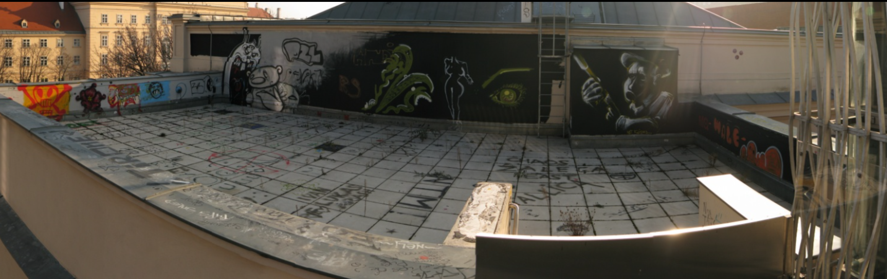
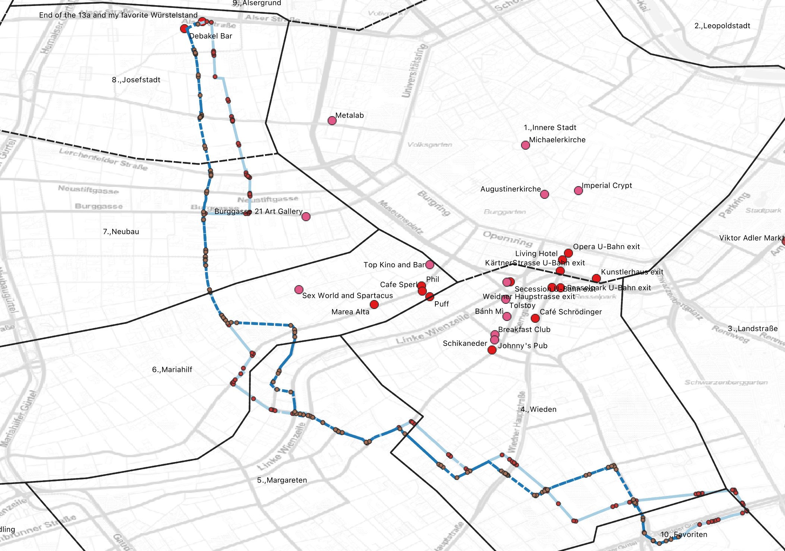

# Journeys - paths through the city which I enjoy

[Top](vienna_guide.md)

## Up and Over, MQ Courtyard to the Spittleberg area. 

If you take the elevator, which is under/next to the daunting stairs for 
the MUMOK (the big grey-black solid thing) you can go to the top,
then exit and walk around to the building which now has metal panels
hiding the view.

On my first trip I thought that this was the 'Street Art Passage.' It made
sense to me, you have to climb, and walk along catwalks (albeit, sturdy
catwalks with solid railings), and then you would be rewarded with a glimpse
of a bit of street art.

[From this gigapan](https://gigapan.com/gigapans/39056)

[From this gigapan](https://gigapan.com/gigapans/39055)

You'll pass by the Glacis Beisl, which Johannes says 'they have the best Grammelknödel in Vienna.'

"What are grammelknödel? They’re handball-sized dumplings (often made of potato, but occasionally of semolina) filled with the most intensely porky stuffing—cracklings (the gelatinous skin of the pig, along with some of the adjacent meat and fat), onions, garlic, and fresh herbs, cooked forever, or at least until the mixture turns deep brown and almost jam-like in consistency."

Once over,, explore the streets between Siebenstergasse and Burgasse. Kirchberggasse, Gutenberggasse, 
Spittelberggasse, und so wieder.

You can get the 49 Tram on Seibensterngasse and go back to the ring. Or go to Neubaugasse, where
Seibensterngasse ends, and take the 13a bus either direction. 

Or take Kirchngasse or Neubagasse south to Mariahilferstrasse, or beyond to the Naschmarkt.

## Schottentor, tram 43/44, bus 13a

Take the U-Bahn to Schottentor. This is one of the 'interesting' and busy
U-Bahn stations. It is also one of the places where you can get food or
liquor until quite late.

Go up the stairs to the 43/44 tram stop. Take the tram two stops to Skodagasse.

Have a Würst at 'Imbiss Claudia,' where I have spent many evenings.

If you want, walk 100 meters to the Debakel bar. Come back and take the 13a
bus for as long as you wish.

The 13a is sometimes called 'the hipster bus' because it passes through some
of the most hipster areas of Vienna. 

## Karl Marx Hof, Cobenzl, Kahlenberg

## Gasometer

## Donauinsel

## D Tram

## Vienna Ring, or use Tram 1 and Tram 2
