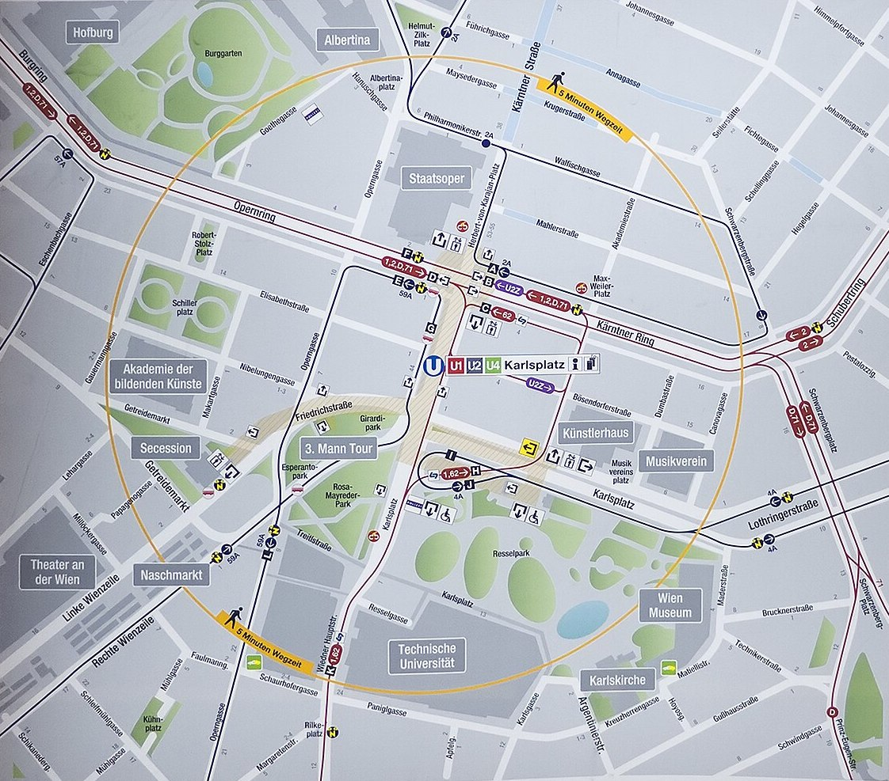
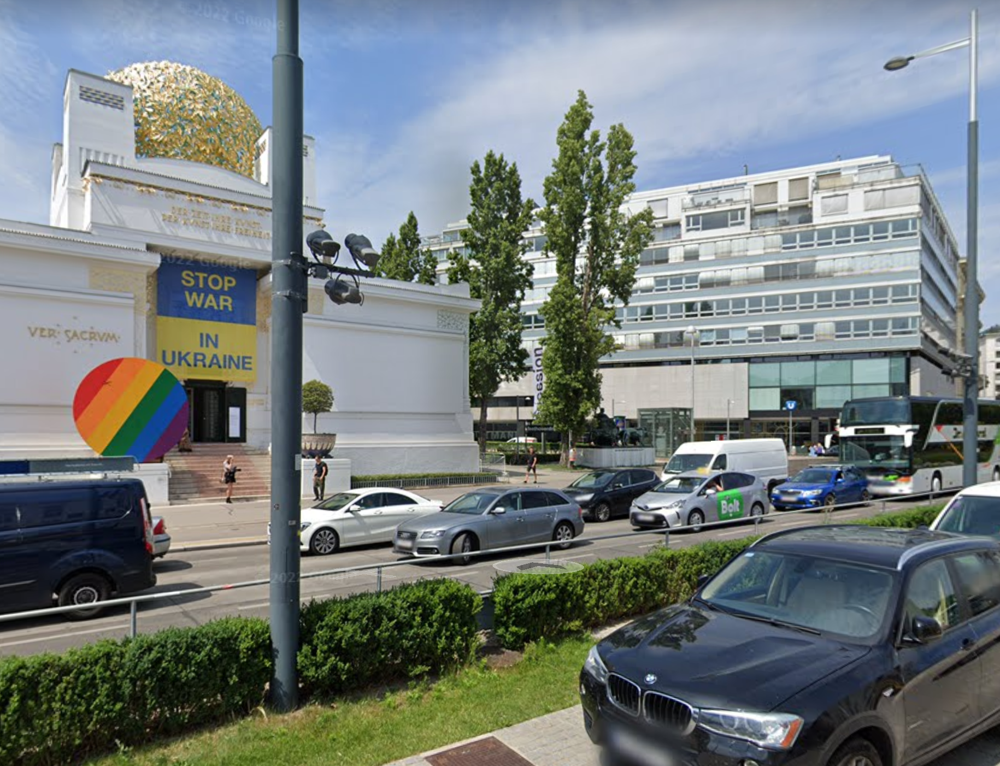

# Karlsplatz and the Living Hotel

The Karlsplatz U-Bahn station is huge, and the streets above the station
are hideously busy and hard to cross, so it is much better to understand
the station exits and exit at the correct place.

<a href="img/Karlsplatz_Umgebungsplan_b.jpg">

 
Area plan from Karlsplatz U-Bahn station
</a>

<a href="img/karlsplatz_exit1.png">
 
 
Weidner Haupstraße, Secession, and Opera are far apart, but this sign is deep in 
the bowels of the U-Bahn, where all exits are up.
</a>

<a href="img/karlsplatz_kartner_strasse.png">
 
 
Kartner Strasse exit - what you want for the Living Hotel
</a>

<a href="img/karlsplatz_living_hotel.png">
 
 
Living Hotel Streetview. The Living Hotel is on the corner with the blue sign.
</a>

<a href="img/karlsplatz_opera.png">
 
 
Opera U-Bahn entrance, Streetview
</a>

<a href="img/karlsplatz_resselpark_exit.png">
 
 
Resselpark U-Bahn entrance, Streetview
</a>

<a href="img/karlsplatz_secession.png">
 
 
Secession U-Bahn entrance, Streetview
</a>

<a href="img/karlsplatz_weidner_haupstrasse.png">
 
 
Weidner Haupstrasse exit Streetview
</a>
